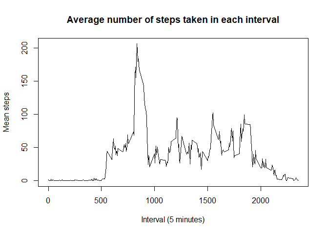
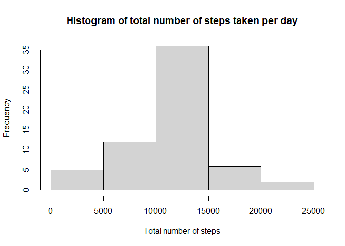
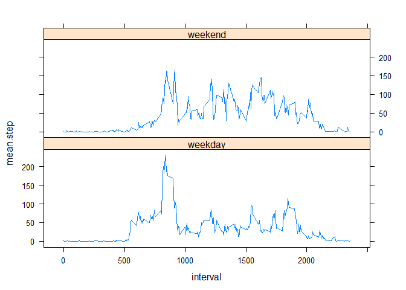

## Loading and preprocessing the data


```r
# unzip and read the data file
unzip("activity.zip")
data <- read.csv("activity.csv")
# an overlook of the data
head(data)
```

```
##   steps       date interval
## 1    NA 2012-10-01        0
## 2    NA 2012-10-01        5
## 3    NA 2012-10-01       10
## 4    NA 2012-10-01       15
## 5    NA 2012-10-01       20
## 6    NA 2012-10-01       25
```

```r
tail(data)
```

```
##       steps       date interval
## 17563    NA 2012-11-30     2330
## 17564    NA 2012-11-30     2335
## 17565    NA 2012-11-30     2340
## 17566    NA 2012-11-30     2345
## 17567    NA 2012-11-30     2350
## 17568    NA 2012-11-30     2355
```

The activity data is shown above, from 2012-10-01 to 2012-11-30 with steps in each 5 minute intervals each day shown in a sequence.

## What is mean total number of steps taken per day?  
1. Calculate the total number of steps taken per day

```r
# compute number of total steps per day
library(dplyr)
sum.step <- data %>% group_by(date) %>% summarise(total.step=sum(steps,na.rm = T))
sum.step
```

```
## # A tibble: 61 x 2
##    date       total.step
##    <chr>           <int>
##  1 2012-10-01          0
##  2 2012-10-02        126
##  3 2012-10-03      11352
##  4 2012-10-04      12116
##  5 2012-10-05      13294
##  6 2012-10-06      15420
##  7 2012-10-07      11015
##  8 2012-10-08          0
##  9 2012-10-09      12811
## 10 2012-10-10       9900
## # ... with 51 more rows
```
The total number of steps taken per day is shown above. For days the observations of which are all missing, their total number of steps is counted as 0.

2. Make a histogram of the total number of steps taken each day

```r
hist(sum.step$total.step, main = "Histogram of total number of steps taken per day", xlab = "Total number of steps")
```

<!-- -->

The distribution of total number of steps per day from 2012-10-01 to 2012-11-30 is shown in the histogram above. We can see that about half of the days the person has a total daily steps between 10,000 and 15,000. He does not often makes total daily steps more than 20,000.

3. Calculate and report the mean and median of the total number of steps taken per day

```r
summary(sum.step$total.step)
```

```
##    Min. 1st Qu.  Median    Mean 3rd Qu.    Max. 
##       0    6778   10395    9354   12811   21194
```
The mean of total number of steps taken per day is 9354, and the median is 10395.

## What is the average daily activity pattern?

1. Make a time series plot (i.e. \color{red}{\verb|type = "l"|}type = "l") of the 5-minute interval (x-axis) and the average number of steps taken, averaged across all days (y-axis)

```r
# compute average number of steps per time interval
step.interval <- data %>% group_by(interval) %>% summarise(mean.step= mean(steps,na.rm = T))
# time series plot
plot(step.interval$interval, step.interval$mean.step, type = "l", main = "Average number of steps taken in each interval", xlab = "Interval (5 minutes)", ylab = "Mean steps")
```

<!-- -->

The average daily activity pattern is shown above. In average, the person basically starts activities after the first 500 intervals. Then, the person makes most frequent activities approximately between 750 and 900 intervals, making approximately 150 to 200 steps per 5 minutes. The average personal activities reduces to approximately zero at the end of the day.

2. Which 5-minute interval, on average across all the days in the dataset, contains the maximum number of steps?


```r
step.interval[step.interval$mean.step==max(step.interval$mean.step),]
```

```
## # A tibble: 1 x 2
##   interval mean.step
##      <int>     <dbl>
## 1      835      206.
```
The 835th interval, on on average across all the days, contains the maximum number of steps, which is 206.

## Imputing missing values

1. Calculate and report the total number of missing values in the dataset (i.e. the total number of rows with \color{red}{\verb|NA|}NAs)

```r
sum(is.na(data$steps))
```

```
## [1] 2304
```
In total, there are 2304 missing values of steps in the data set.

2. Devise a strategy for filling in all of the missing values in the dataset.   

Here, I use the mean steps in each interval to fill in those missing values. Since mean steps have decimals, they are rounded to the nearest intergers.

```r
# index the missing values in the raw data
na.index <- is.na(data$steps)
# fill in imputed data for missing value
impute.data <- rep(0,17568)
for (i in 1:17568) {
    if (na.index[i]){
        impute.data[i] <- step.interval$mean.step[step.interval$interval==data$interval[i]]
    }
    else {
        impute.data[i] <- data$steps[i]
    }
}
# round mean steps to nearest integers
impute.data <- round(impute.data)
```
As the code shows, impute.data contains all the steps values for each interval in each day. For those observations with missing values, steps are imputed using mean steps; otherwise, the original steps values are shown.  

3. Create a new dataset that is equal to the original dataset but with the missing data filled in.

```r
# fill in impute.data into the new data set
new.data <- data
new.data$steps <- impute.data
# an overlook at the new dataset
head(new.data)
```

```
##   steps       date interval
## 1     2 2012-10-01        0
## 2     0 2012-10-01        5
## 3     0 2012-10-01       10
## 4     0 2012-10-01       15
## 5     0 2012-10-01       20
## 6     2 2012-10-01       25
```

```r
tail(new.data)
```

```
##       steps       date interval
## 17563     3 2012-11-30     2330
## 17564     5 2012-11-30     2335
## 17565     3 2012-11-30     2340
## 17566     1 2012-11-30     2345
## 17567     0 2012-11-30     2350
## 17568     1 2012-11-30     2355
```

4. Make a histogram of the total number of steps taken each day and Calculate and report the mean and median total number of steps taken per day.


```r
sum.new <- new.data %>% group_by(date) %>% summarise(total.step=sum(steps))
# plot histogram of the total number of steps taken each day
hist(sum.new$total.step, main = "Histogram of total number of steps taken per day", xlab = "Total number of steps")
```

<!-- -->

```r
# compute mean and median total number of steps taken per day
summary(sum.new$total.step)
```

```
##    Min. 1st Qu.  Median    Mean 3rd Qu.    Max. 
##      41    9819   10762   10766   12811   21194
```

As shown above, the mean total number of steps taken per day is 10766, and the median is 10762.

Do these values differ from the estimates from the first part of the assignment? What is the impact of imputing missing data on the estimates of the total daily number of steps?

These values differ from the estimates from the first part of the assignment. By filling in mean steps for missing values, there are less days with extremely low daily steps. Thus, the mean and median daily steps are increased. 

## Are there differences in activity patterns between weekdays and weekends?

1. Create a new factor variable in the dataset with two levels – “weekday” and “weekend” indicating whether a given date is a weekday or weekend day.

```r
new.data$date <- as.Date(new.data$date,"%Y-%m-%d")
# indicating which day in a week the date is and then determine whether it is a weekend or weekday
new.data$weekday <- weekdays(new.data$date)
for (i in 1:17568){
    if (new.data$weekday[i]=="Saturday"||new.data$weekday[i]=="Sunday"){
        new.data$weekday[i]="weekend"
    }
    else{
        new.data$weekday[i]="weekday"
    }
}
new.data$weekday <- as.factor(new.data$weekday)
# an overlook at the weekday variable
str(new.data)
```

```
## 'data.frame':	17568 obs. of  4 variables:
##  $ steps   : num  2 0 0 0 0 2 1 1 0 1 ...
##  $ date    : Date, format: "2012-10-01" "2012-10-01" ...
##  $ interval: int  0 5 10 15 20 25 30 35 40 45 ...
##  $ weekday : Factor w/ 2 levels "weekday","weekend": 1 1 1 1 1 1 1 1 1 1 ...
```


2. Make a panel plot containing a time series plot (i.e. \color{red}{\verb|type = "l"|}type = "l") of the 5-minute interval (x-axis) and the average number of steps taken, averaged across all weekday days or weekend days (y-axis).


```r
# compute average steps for each interval separated by weekday and weekend
step.interval.weekday <- new.data %>% group_by(interval,weekday) %>% summarise(mean.step= mean(steps))
# plot time series plot
library(lattice)
xyplot(mean.step~interval|weekday, data=step.interval.weekday, type="l",layout=c(1,2))
```

<!-- -->

As shown above, there are some differences in activity patterns between weekdays and weekends. In average, the person starts daily activities earlier on weekdays, and the peak in activities between interval 750 and 900 is higher in weekdays. However, the person remains more active when he/ she is awake from interval 1000 to 2000 on weekends.

